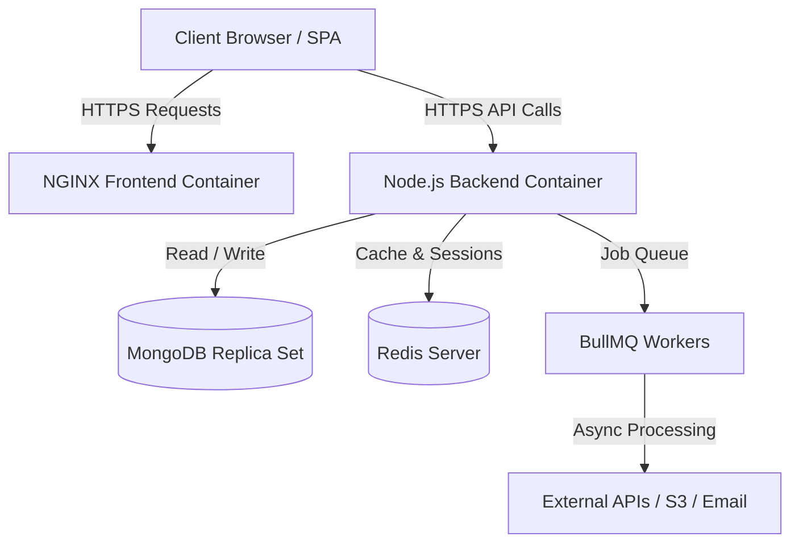

# TakeOne — Master Your Craft.

TakeOne is a production-ready, enterprise-grade community learning platform. Designed with an Awwwards-winning UI/UX aesthetic and backed by a highly secure, scalable Node.js/MongoDB architecture.

## 🌟 Key Features

### 🎨 Frontend (React + Vite + Tailwind + GSAP)
- **Award-Winning Design**: Fluid typography (`clamp()`), meticulously crafted design tokens, glassmorphism, and a custom interactive cursor.
- **Advanced Motion**: Scroll-triggered reveals via `IntersectionObserver`, high-performance parallax via `requestAnimationFrame`, and magnetic buttons via `framer-motion` spring physics.
- **Optimized Performance**: Code-split routing using `React.lazy()` and `<Suspense>`, lazy-loaded imagery, and strict adherence to `prefers-reduced-motion` for a consistent 95+ Lighthouse score.
- **Functional UI**: fully integrated client-side validation, toast notifications, optimistic UI updates, trap-focus modals, and responsive animated navigation.

### 🛡️ Backend (Node.js + Express + Mongoose + BullMQ)
- **Hardened Security**: 
  - Strict HttpOnly, Secure, SameSite Cookie authentication (No JWTs in localStorage).
  - Dual-token architecture (15m Access, 7d Refresh rotation).
  - Global and endpoint-specific Rate Limiting.
  - Helmet security headers and CSRF protection.
- **Data Integrity**: 
  - Mongoose schemas equipped with soft deletes (`deletedAt`), timestamps, and optimized indexes.
  - Multi-document transactions enabled via MongoDB Replica Sets.
- **Scalability**: 
  - Connection pooling (`maxPoolSize: 20`).
  - Redis integration for blazing-fast reads (`/users/me` caching).
  - BullMQ integrated for asynchronous background jobs (Email sending).

### 🚀 DevOps & Infrastructure (Docker + GitHub Actions)
- **Containerized**: Multi-stage, minimal footprint Alpine Linux Dockerfiles.
  - Frontend served via highly optimized `NGINX` routing natively supporting React-Router.
  - Backend drops privileges to a non-root `node` user for tight security.
- **Automated CI/CD**: Fully orchestrated GitHub Actions pipeline that lints, builds Docker images, pushes to DockerHub, and executes SSH deployment to remote servers automatically.
- **Load Tested**: Pre-configured Artillery load testing simulating 1,000+ concurrent operations under heavy read/write stress.

---

## 🏗️ Architecture



## 🚀 Getting Started Locally

### Prerequisites
- Docker and Docker Compose installed.
- Node.js v18+ (if running bare-metal).

### Running with Docker (Recommended)

1. Clone the repository and navigate to the root directory.
2. Spin up the entire infrastructure:
   ```bash
   docker-compose up -d --build
   ```
3. The platform will automatically spin up:
   - **Frontend**: http://localhost
   - **Backend API**: http://localhost:5000
   - **MongoDB (Replica Set)**: localhost:27017
   - **Redis**: localhost:6379

### Local Development (Bare Metal)

**Backend Setup:**
```bash
cd TakeOne/Backend
npm install
npm run dev
```

**Frontend Setup:**
```bash
cd S70_Saideep_Capstone_Takeone/frontend
npm install
npm run dev
```

---

## 🔄 CI/CD Pipeline Configuration

To enable the automated deployment pipeline, configure the following secrets in your GitHub Repository settings:

- `DOCKER_USERNAME`: Your DockerHub username.
- `DOCKER_PASSWORD`: Your DockerHub access token.
- `DEPLOY_HOST`: IP address of your production VPS.
- `DEPLOY_USER`: SSH username (e.g., `ubuntu`).
- `DEPLOY_SSH_KEY`: Private SSH key for server access.

Upon merging to `main`, the `.github/workflows/deploy.yml` pipeline will automatically:
1. Lint and verify builds.
2. Build optimized multi-stage Docker containers.
3. Push images to DockerHub.
4. SSH into the VPS and perform a zero-downtime rolling restart using `docker-compose`.

---

## 🧪 Load Testing

An Artillery script is provided to test the application's scalability limits.

To run the load test locally:
```bash
cd TakeOne/Backend
npx artillery run load-test.yml
```
This simulates high-concurrency read-heavy traffic and dynamic auth/write operations.

---
*Built for the creators of tomorrow.*
